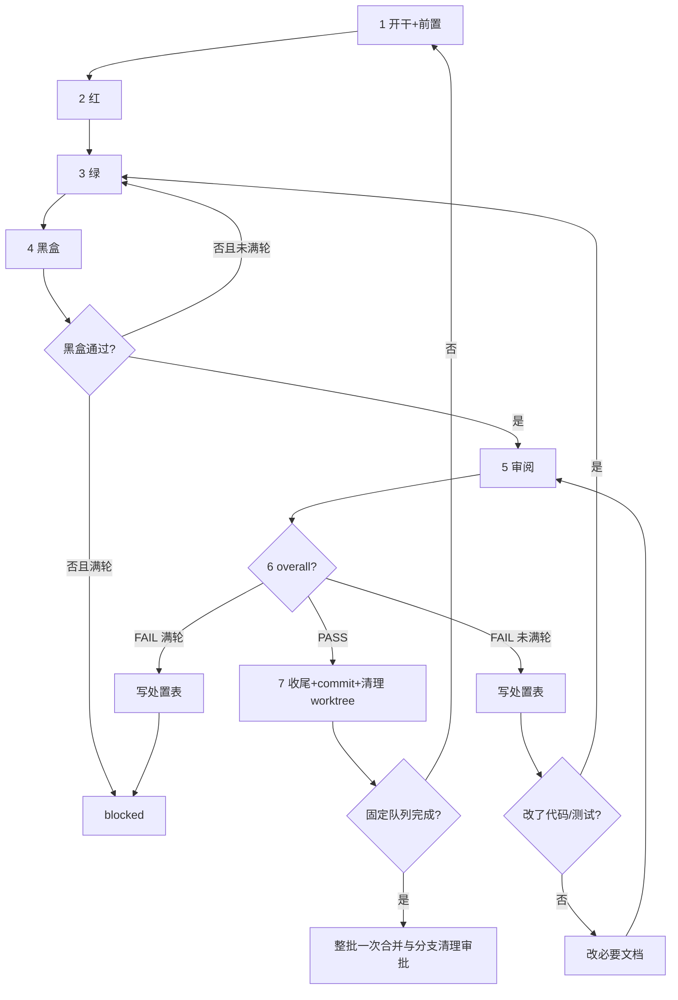

# task-run

串行执行待做 task，直到固定队列完成或必须停。状态机、blocked、目录权责等权威规则见 `AGENTS.md`；门禁数字见本 skill；本 skill 定义链式分支与批次操作顺序。

## 队列执行已获批准

用户触发本 skill 表示批准固定队列内全部 task 执行至各自执行 commit 完成，**不表示批准修改本地 main**。禁止进入 plan mode（`EnterPlanMode` / `ExitPlanMode`），禁止开跑前重述计划征求同意，禁止把 spec 已写明内容再问一遍。直接从 Step 1 开始。

每个 task 完成后不询问合并。只有固定队列全部完成，才一次询问是否把链尾分支合并本地 main，并在合并后验证通过后清理链尾祖先链中已合入 main 的本地 task 分支。

## 输入与固定队列

| 用户输入 | 队列 |
|----------|------|
| 无参数 | `backlog` ∪ `active`（tid 升序）；不含 blocked / done / dropped |
| 一个或多个 `tNNN` | 严格按用户输入顺序，只跑这些（须 backlog/active；含 blocked 则整批停止，请用户选择加轮/dropped） |
| 状态词 `backlog` 和/或 `active` | 只跑这些状态的全部，tid 升序 |
| 写了 `blocked` | `blocked` 不入队。先按「整批停止条件」呈 blocked 选项请用户决策；用户当次明确继续后，再跑其余可跑 tid |

`done` / `dropped` 永不重新入队。CLI 一次只能带一个 `--status`，默认队列由两次 list 合并去重。开始修改状态前固定 tid 与顺序；批次中禁止从 main 重新计算队列。

## 链与恢复

目标拓扑：

```text
main
  └─ t001_branch
       └─ t002_branch
            └─ t003_branch
```

- 首 task 从批次开始时本地 main HEAD（或用户指定 `--base`）创建。
- 后续 task 从上一已完成 task 分支 HEAD 创建，**不要求该分支以当前 main 为祖先**（批次期间 main 可并行推进）。
- 每个 task commit 后删除自身 worktree，分支保留至整批合并与验证完成。
- Git ancestry 是链关系权威，不另写 parent/batch 元数据。
- `batch_main_anchor` = 本批首 task 的 `diff_anchor`（链根 base SHA）。合并阶段用于判断 main 是否与链根分叉；不要求批次期间 main 冻结。首次启动时记录；恢复时从链尾 ref 中本批最早 task 的 front matter 读取，不另设持久字段。

开始或恢复前按以下优先级判断状态：

1. 已登记 task worktree：进入该 worktree，用 `scripts/repo_template/task.py show <tid>` 读 active/blocked 与未提交证据。
2. 未合并 task 分支链：用 `scripts/repo_template/task.py show/list --ref <branch>` 读累计状态。
3. main：只用于尚未进入链的 backlog task。

链尾发现：列出未合并 main 的 `t[0-9]*_*` 本地分支，用 `git merge-base --is-ancestor` 比较本批候选分支。唯一不被其他候选包含的分支是链尾。存在多个互不为祖先的链尾时整批停止，列出分支与 HEAD，请用户选择；禁止自动选链、merge 或 rebase。

兼容旧 active task：已存在登记 worktree或历史 start commit时，从现有证据续跑，不重走 start，不改写历史 commit。后续新 task 可从其完成分支继续链。

## 队列循环

1. 按输入固定队列，记录 `batch_main_anchor` 与已发现链尾。
2. 一次只跑一个 tid；禁止并行多 task（单 task 内可派 subagent）。
3. 当前 task 执行 commit 完成后，从主仓清理其 worktree；不 merge、不重建 index、不询问用户。
4. 当前 task 分支成为下一 task 的 base；队列全部完成后进入「整批合并审批」。
5. 当前 task `blocked` → 整批停止，不自动跳下一个（除非用户显式要求 drop/移出本批）。
6. 「循环」= 本 skill 内串行推进，不是后台常驻。

## 单 task 流程

门禁默认：`max_verify_round = 5`（黑盒）；`max_review_round = 5`（审阅）。`{doctor_cmd}` / `{test_cmd}` / `{blackbox_verify}` 见 `docs/blueprint/testing.md`。



开始或继续每个 task 时，先重新读仓库判断入口（worktree/链尾 ref 中的 `scripts/repo_template/task.py show <tid>` + task 目录下 `spec.md` / `task.md` / `review_*.md` + 分支 + `git status` + `diff_anchor` + 测试与实施笔记）：

| 状态 / 证据 | 从哪继续 |
|-------------|---------|
| `backlog`，无 task 分支/worktree | Step 1 |
| `active`，无红灯证据 | Step 2 |
| 红已有、实现未完 | Step 3 |
| 绿过、黑盒未过 | Step 4 |
| 黑盒过、无审阅 | Step 5 |
| 有 FAIL、未满轮 | Step 6 处置后按表回流 |
| `blocked` | 停止整批，呈 blocked 选项 |
| 链尾 ref 中 `done` / `dropped` | 跳过，不重复执行 |

### Step 1：开干与前置

1. 有 `{doctor_cmd}` 则跑；无则实施笔记写「无」。失败：停本 task 及整批，先解决环境或走 spike，不盲目 start。
2. 没有现成 active worktree时，在主仓默认分支执行 start（不要求主仓干净，worktree 基于当前 main HEAD 创建）：
   - 批次首 task、无链尾：`scripts/repo_template/task.py start <tid>`。
   - 后续 task：`scripts/repo_template/task.py start <tid> --base <上一 task 分支>`。
   - `start` 不修改 main、不建 start commit；新 worktree 中 task.md 的 active 改动属于当前 task 执行 commit。
3. 必须 `cd` 进新 worktree；后续 Step 1–7c 都在其中进行。
4. 执行 `scripts/repo_template/task.py preflight <tid>`：状态、spec 完整、工作区一致性与未知契约分类。
   - `UNVERIFIED-BLOCKING` 或裸 `UNVERIFIED` → FAIL，必须停止。
   - `UNVERIFIED-SPIKE` → WARN；当前只可继续 Step 1 实验，不得进入 Step 2。
5. spec 契约区行为 AC 非空再继续（preflight 已查）。
6. spec 上下文区有 `UNVERIFIED-SPIKE`：先做实验，文档查询不能替代兼容实验。需外部环境的 SPIKE 先查环境齐备性（key、代理、夹具）并做最小实测；未实测不得以「难验证」上报阻断，实测失败须附输出证据；优先走 spec 预留的保守回退方案，而非中断。建 `docs/spikes/{sid}_{slug}/`（`sid` 取 spikes 与 archive 中最大编号加一），复制 `docs/spikes/report_template.md` 为 `report.md`；有实验代码建 `code/`。结论总结写入 `docs/findings.md`，报告留在 spike 目录。
7. 将全部 `UNVERIFIED-SPIKE` 改写为验证结论与验证方式，再运行 `scripts/repo_template/task.py preflight <tid> --require-verified`。严格门禁 PASS 后才可进入 Step 2。

### Step 2：红

可测部分先写失败测试；`{test_cmd}` 确认失败。测试须触达生产逻辑。

### Step 3：绿

实现至测试通过；`{test_cmd}` 确认。量大可派 subagent。

变更命中 `docs/blueprint/testing.md`「Schema / codegen 验证」触发路径时，运行其中生成命令与验证命令；未声明或写「无」则跳过。涉及 migration 独占窗口时，不与其他 migration 并行。生产 migration、部署和数据操作不由本步骤或普通 merge 自动执行。

改既有测试纪律见 `AGENTS.md`「开发原则」TDD 条款。

### Step 4：黑盒

按 `docs/blueprint/testing.md` 中 `{blackbox_verify}` 执行。通过→Step 5。未通过且 `< max_verify_round` → 回 Step 3 再黑盒。未通过且 `≥ max_verify_round` → `block --reason blackbox`，整批停止。

### Step 5：审阅

- 用 `git ls-files --others --exclude-standard` 列出本 task 新文件，剔除无关/临时/`.scratch/` 后，对明确路径执行 `git add -N -- <path...>`，让 untracked 产出进入 `git diff {diff_anchor}`；无新文件则跳过。不得用无路径 `git add -N`。
- 渲染 prompt：
  ```bash
  scripts/repo_template/render_review_prompts.py \
    --task-dir docs/tasks/{tid}_{slug} \
    --out-dir .scratch/review_prompts
  ```
- 派 subagent 时只传文件路径，不把 prompt 正文内联进派发消息。
- `review_level=full`：code + test 两路并行；`single`：一路 general。
- 报告写入 task 目录：`full` 写 `review_code.md` / `review_test.md`；`single` 写 `review_general.md`。多轮追加，不覆盖历史。

### Step 6：处置

- 处置表唯一落点：`task.md` → `## Review 处置`。`status` 仅：`已修` / `遗留` / `撤回`。
- `status=遗留` 的内容不写 task.md：先运行 `scripts/repo_template/pending.py next`，登记到 `docs/pending.md`「待办」节；`fix_ref` 填 `pNNN` 或已有 follow-up tid。
- 运行：
  ```bash
  scripts/repo_template/check_review_status.py \
    --task-dir docs/tasks/{tid}_{slug} \
    --max-review-round <N>
  ```
- `prompt_hint` 非空 → 下一轮派发附上轮撤回 finding_id 与理由。
- reviewer 标注 spec 过时：改 spec 上下文区，不计 FAIL，不因此回 Step 3。
- `overall=PASS` → Step 7。
- `FAIL` 且 `round < max`：填处置表；改代码/测试则 Step 3→4→5→6，只改必要文档也须回 Step 5 完整重审。
- `FAIL` 且 `round ≥ max`：处置表填完 → `block --reason review`，整批停止。
- 禁止同一 round 内「复核翻 PASS」。

### Step 7：收尾、执行 commit 与 worktree 清理

进入本步前重新运行 `check_review_status.py`，确认最新 `overall=PASS`。

**7a 收尾文档（worktree 内）**：

- 更新 `docs/specs/<slug>.md` 与 `docs/specs_index.md`。
- 更新受影响的 `docs/blueprint/`、`docs/guides/`、`README.md`、`AGENTS.md`、API 文档等。
- 写全 `task.md` 收尾报告；收尾报告不设遗留节，遗留在 `docs/pending.md`。
- pending 闭环：相关条目标记当前 tid，整条从 `docs/pending.md` 移除并追加到 `docs/archive/pending.md`。
- 顺手发现登记（必做）：实施/测试/黑盒中观察到、但不属本 task 范围且未修的疑似存量问题，不得只写 `task.md` 笔记——`task.md` 随 task 归档后这些发现无人跟踪。逐条盘点处置：已复现确认的 bug 链式走 `task-bug`（根因 + 补测 + 登记）；疑点或技术债按普通模板登记 `docs/pending.md`（先 `scripts/repo_template/pending.py next` 取号）。已随本 task 修复或确认不成立的不登记。
- 测试假绿专项（必做）：测试过程中发现疑似假绿（断言过弱、mock 掉被测逻辑、只测假路径、缺集成层导致测试通过但逻辑有误）的存量测试，同样必须登记——能定位根因的走 `task-bug` 补测分析，暂不能定位的按普通模板登记 `docs/pending.md` 并注明疑似假绿。不得在收尾报告里一笔带过。
- 核对所有 `status=遗留` 行的 `fix_ref` 已指向 `pNNN` 或 follow-up tid。
- 抽取可跨 task 复用的已验证事实到 `docs/findings.md`。
- 排在其后且未 `done` 的 task 若受影响，修订其 `spec.md`；后续链会继承这些修订。

**7b finish（worktree 内）**：

```bash
scripts/repo_template/task.py finish <tid>
```

`finish` 将 task 归档并清空归档 front matter 的 worktree 字段；物理 worktree 此时仍存在。

**7c 执行 commit（worktree 内）**：

- 把本 task 执行期全部改动（含 7a 文档、7b 归档移动）一次性 commit；subject 含 `{tid}`。
- 一 task 一执行 commit。旧 active task已有历史 start commit时保留历史，不重写。
- commit 后确认 worktree clean、分支 HEAD 相对 `diff_anchor` 包含当前 task commit。

**7d 清理 worktree（主仓）**：

```bash
cd <主仓>
scripts/repo_template/task.py cleanup-worktree <tid>
```

- 清理后确认 worktree 已移除、task 分支保留至整批合并与验证完成。
- 不 merge main，不重建 index，不询问用户。
- 当前 task 分支成为下一 task `--base`。
- blocked 未放行前不 finish、不 commit终态、不清理 worktree。

## 整批合并审批

仅当固定队列每个 tid 在链尾 ref 中均为 `done`，或经用户明确决定为 `dropped`，且所有相关 worktree 已清理，才进入本节。blocked、preflight FAIL、环境阻断或用户限制中间终点都不进入合并询问。

询问前只读核对并展示：

- `batch_main_anchor`、当前 main HEAD。两者不同表示批次期间 main 已并行推进；合并为三方 merge，见下。
- 链尾分支与 HEAD。
- 固定队列及链尾 ref 中最终状态。
- `git log --oneline main..<链尾>`。
- 测试、黑盒、review 结果。
- `git worktree list` 中无本批 task worktree。
- 链尾祖先链中尚未合入当前 main 的全部本地 task 分支及各自 HEAD；用 `git merge-base --is-ancestor <候选分支> <链尾>` 与 `git merge-base --is-ancestor <候选分支> main` 逐个判定。这是批准后分支清理的完整范围，包含之前暂缓合并后续接到本链的已完成分支，禁止按固定队列漏项或用通配符扩大。
- 批准后还会产生一条 merge commit 与一条 index 维护 commit；合并后动作及验证全部通过后，删除上述已完全合入 main 的本地 task 分支。

然后只询问一次是否合并本地 main 并清理上述本地 task 分支。

- 用户未批准或暂缓：main 不变；保留完整分支链；汇报恢复所需链尾与 HEAD。
- 用户批准：再次确认 main、链尾 HEAD、待清理分支 HEAD、工作区状态未变化，再执行：
  1. `git merge --no-ff <链尾分支>`，只合并链尾一次；祖先链自动包含全部 task commit。链尾与当前 main 分叉时为三方 merge：
     - 无冲突：merge 完成，进入步骤 2。
     - 有冲突：停下报告冲突文件；解决后 `git add` + `git commit` 完成 merge。无法解决则 `git merge --abort` 回退，链尾分支与 main 保持不变，报告失败由用户裁决，不盲目重试。
  2. 执行声明的合并后验证；失败则报告实际 merge 状态并停止后续步骤，保留询问前列明的待清理分支。main 已含 merge commit；恢复时在用户处置后从步骤 3 重入（rebuild index → 提交 → 合并后动作与验证 → 分支清理）。不盲目重试或回退 merge。
  3. `scripts/repo_template/task.py list --rebuild`。
  4. 只提交 `docs/tasks_index.json` 与 `docs/archive/tasks_index.json`，形成独立维护 commit。
  5. 再执行 `docs/blueprint/testing.md` 声明的合并后动作及验证；失败则报告实际状态并停止分支清理。恢复时从本步骤重入，重建后的派生 index 已提交，可继续验证与清理。
  6. 逐个清理询问前列出的待清理 task 分支：确认分支 HEAD 未变化、未被 worktree 使用，且 `git merge-base --is-ancestor refs/heads/<分支> main` 成功后执行 `git branch -d -- <分支>`。任一条件不满足或删除失败时保留该分支并报告；禁止 `git branch -D`。

## 整批停止条件

停止条件仅限本节列举的可验证事件，agent 不得自行扩充（如 task 规模大、SPIKE 多、主观估计上下文将耗尽）。是否继续以系统提供的上下文占用客观数据为准，不以主观工作量感推断；数据不明确时默认继续——中断代价确定，耗尽风险由系统压缩与中间态恢复兜底。

遇任一即停，不自动跳当前 task跑下一个：

- `preflight` FAIL 且无法在本 task 内修复。
- 当前 task `blocked`（呈加轮 / dropped）。
- 需用户提供密钥、环境、产品决策等不可替代输入。
- 环境/权限/外部依赖阻断；基础设施连续失败 → `block --reason infra`。
- 用户限制本次终点。
- 工作区有与本队列冲突的无关脏改动且无法安全隔离。
- 出现多条不相容未合并 task 分支链。
- 整批 merge 冲突未解决，或任一合并后动作/验证失败；保留询问前列明的待清理分支。

停止时不询问合并。保留已完成前缀分支；当前 active/blocked worktree 保留；汇报已完成 tid、当前阻塞、剩余固定队列与恢复入口。只有用户明确 drop/移出剩余项并重新界定批次范围后，才按新范围判断是否进入整批合并审批。

## 完成

汇报：固定队列、已完成 tid、链尾分支与 HEAD、main 是否已获批合并、index 维护结果、待清理 task 分支删除/保留结果、停止原因与剩余队列（若有）。
