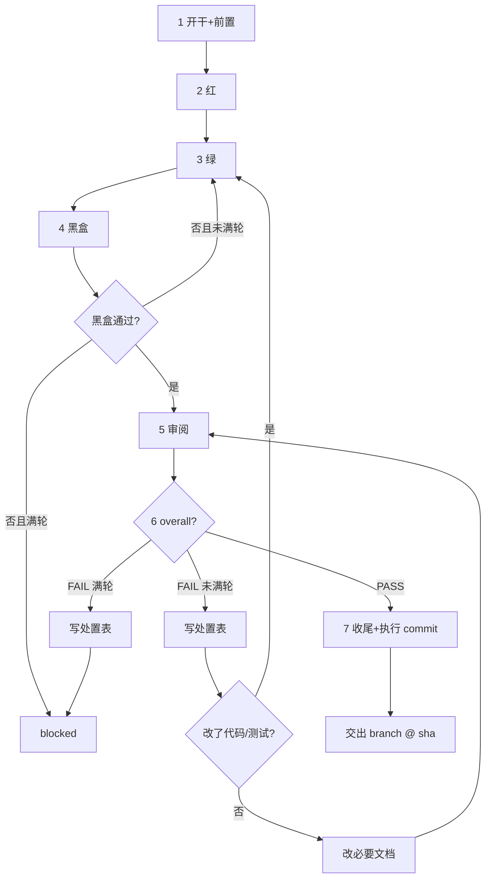

# task-work

在给定 worktree 内执行单个 task，止于执行 commit。本 skill 是 **worker 角色**：只写自己的 worktree，不碰主仓。状态机、目录权责、角色边界见 `AGENTS.md`；门禁数字见本 skill。

## 执行已获批准

用户或 coordinator 触发本 skill 表示批准把该 task 执行至执行 commit 完成。禁止进入 plan mode（`EnterPlanMode` / `ExitPlanMode`），禁止开跑前重述计划征求同意，禁止把 spec 已写明内容再问一遍。直接从 Step 1 开始。

## worker 边界

本 skill 全程在 task 自己的 worktree 内进行，唯一例外是 Step 1 的 `start`（尚无 worktree 时须在主仓执行一次）。

禁止：合并任何分支、`task.py integrate`、`task.py list --rebuild`、`git push`、删除分支、清理自己的 worktree、修改其他 task 的文件、询问是否合并主干。这些属于 coordinator，由 `task-integrate` 承担。

## 输入

一个 `tNNN`。task 须为 `backlog` / `active`；`blocked` 须用户先放行或改判。

## 单 task 流程

门禁默认：`max_verify_round = 5`（黑盒）；`max_review_round = 5`（审阅）。`{doctor_cmd}` / `{test_cmd}` / `{blackbox_verify}` 见 `docs/blueprint/testing.md`。



开始或继续时，先重新读仓库判断入口（`scripts/repo_template/task.py show <tid>` + task 目录下 `spec.md` / `task.md` / `review_*.md` + 分支 + `git status` + `diff_anchor` + 测试与实施笔记）：

| 状态 / 证据 | 从哪继续 |
|-------------|---------|
| `backlog`，无 task 分支/worktree | Step 1 |
| `active`，无红灯证据 | Step 2 |
| 红已有、实现未完 | Step 3 |
| 绿过、黑盒未过 | Step 4 |
| 黑盒过、无审阅 | Step 5 |
| 有 FAIL、未满轮 | Step 6 处置后按表回流 |
| `blocked` | 停止，呈 blocked 选项 |
| `done` / `dropped` | 已完成，直接交出 branch 与 HEAD |

### Step 1：开干与前置

1. 有 `{doctor_cmd}` 则跑；无则实施笔记写「无」。失败：停止，先解决环境或走 spike，不盲目 start。
2. 没有现成 worktree 时，在主仓默认分支执行 `scripts/repo_template/task.py start <tid>`（不要求主仓干净）：并行（task-dispatch）从主干 HEAD 扇出；串行（task-run）由调用方先 `start --base <上一已完成 task 分支>` 建好 worktree，本 skill 发现现成 worktree 时直接 `cd` 进入，**不得**重新 start（避免断掉链式拓扑）。`start` 不修改主仓、不建 start commit；新 worktree 中 task.md 的 active 改动属于本 task 执行 commit。
3. 必须 `cd` 进 worktree；后续 Step 1–7 全部在其中进行。
4. 执行 `scripts/repo_template/task.py preflight <tid>`：状态、spec 完整、工作区一致性与未知契约分类。
   - `UNVERIFIED-BLOCKING` 或裸 `UNVERIFIED` → FAIL，必须停止。
   - `UNVERIFIED-SPIKE` → WARN；当前只可继续 Step 1 实验，不得进入 Step 2。
5. spec 契约区行为 AC 非空再继续（preflight 已查）。
6. spec 上下文区有 `UNVERIFIED-SPIKE`：先做实验，文档查询不能替代兼容实验。需外部环境的 SPIKE 先查环境齐备性（key、代理、夹具）并做最小实测；未实测不得以「难验证」上报阻断，实测失败须附输出证据；优先走 spec 预留的保守回退方案，而非中断。用 `scripts/repo_template/spikes.py new --slug <主题>` 建 `docs/spikes/{sid}_{slug}/`（锁内取号并从模板生成 `report.md`）；有实验代码自行加 `code/`。结论用 `scripts/repo_template/findings.py new` 建条目写入，报告留在 spike 目录。
7. 将全部 `UNVERIFIED-SPIKE` 改写为验证结论与验证方式，再运行 `scripts/repo_template/task.py preflight <tid> --require-verified`。严格门禁 PASS 后才可进入 Step 2。

### Step 2：红

可测部分先写失败测试；`{test_cmd}` 确认失败。测试须触达生产逻辑。

### Step 3：绿

实现至测试通过；`{test_cmd}` 确认。量大可派 subagent。

变更命中 `docs/blueprint/testing.md`「Schema / codegen 验证」触发路径时，运行其中生成命令与验证命令；未声明或写「无」则跳过。涉及 migration 独占窗口时，不与其他 migration 并行。生产 migration、部署和数据操作不由本步骤执行。

改既有测试纪律见 `AGENTS.md`「开发原则」TDD 条款。

### Step 4：黑盒

按 `docs/blueprint/testing.md` 中 `{blackbox_verify}` 执行。通过→Step 5。未通过且 `< max_verify_round` → 回 Step 3 再黑盒。未通过且 `≥ max_verify_round` → `block --reason blackbox`，停止。

### Step 5：审阅

- 用 `git ls-files --others --exclude-standard` 列出本 task 新文件，剔除无关/临时/`.scratch/` 后，对明确路径执行 `git add -N -- <path...>`，让 untracked 产出进入 `git diff {diff_anchor}`；无新文件则跳过。不得用无路径 `git add -N`。
- 渲染 prompt：
  ```bash
  scripts/repo_template/render_review_prompts.py \
    --task-dir docs/tasks/{tid}_{slug} \
    --out-dir .scratch/review_prompts
  ```
- 派 subagent 时只传文件路径，不把 prompt 正文内联进派发消息。
- `review_level=full`：code + test 两路并行；`single`：一路 general。
- 报告写入 task 目录：`full` 写 `review_code.md` / `review_test.md`；`single` 写 `review_general.md`。多轮追加，不覆盖历史。

### Step 6：处置

- 处置表唯一落点：`task.md` → `## Review 处置`。`status` 仅：`已修` / `遗留` / `撤回`。
- `status=遗留` 的内容不写 task.md：用 `scripts/repo_template/pending.py new --slug <主题>` 建条目并填写；`fix_ref` 填该 `pNNN` 或已有 follow-up tid。
- 运行：
  ```bash
  scripts/repo_template/check_review_status.py \
    --task-dir docs/tasks/{tid}_{slug} \
    --max-review-round <N>
  ```
- `prompt_hint` 非空 → 下一轮派发附上轮撤回 finding_id 与理由。
- reviewer 标注 spec 过时：改 spec 上下文区，不计 FAIL，不因此回 Step 3。
- `overall=PASS` → Step 7。
- `FAIL` 且 `round < max`：填处置表；改代码/测试则 Step 3→4→5→6，只改必要文档也须回 Step 5 完整重审。
- `FAIL` 且 `round ≥ max`：处置表填完 → `block --reason review`，停止。
- 禁止同一 round 内「复核翻 PASS」。

### Step 7：收尾与执行 commit

进入本步前重新运行 `check_review_status.py`，确认最新 `overall=PASS`。

**7a 收尾文档**：

- 更新 `docs/specs/<slug>.md` 与 `docs/specs_index.md`。
- 更新受影响的 `docs/blueprint/`、`docs/guides/`、`README.md`、`AGENTS.md`、API 文档等。
- 写全 `task.md` 收尾报告；收尾报告不设遗留节，遗留在 `docs/pending/todo/`。
- pending 闭环：`scripts/repo_template/pending.py archive <pNNN...> --fix-ref {tid} --write`。
- 顺手发现登记（必做）：实施/测试/黑盒中观察到、但不属本 task 范围且未修的疑似存量问题，不得只写 `task.md` 笔记——`task.md` 随 task 归档后这些发现无人跟踪。逐条盘点处置：已复现确认的 bug 链式走 `task-bug`（根因 + 补测 + 登记）；疑点或技术债用 `pending.py new` 登记。已随本 task 修复或确认不成立的不登记。
- 测试假绿专项（必做）：测试过程中发现疑似假绿（断言过弱、mock 掉被测逻辑、只测假路径、缺集成层导致测试通过但逻辑有误）的存量测试，同样必须登记——能定位根因的走 `task-bug` 补测分析，暂不能定位的用 `pending.py new` 登记并注明疑似假绿。不得在收尾报告里一笔带过。
- 核对所有 `status=遗留` 行的 `fix_ref` 已指向 `pNNN` 或 follow-up tid。
- 用 `scripts/repo_template/findings.py new` 抽取可跨 task 复用的已验证事实。
- 写交接单 `docs/tasks/{tid}_{slug}/handoff.json`（机器可读契约，随执行 commit 入库；coordinator 的 reconcile 据此验证后才合并）：
  ```json
  {"tid": "{tid}", "status": "done", "branch": "{task 分支}", "base_sha": "<执行 commit 前 HEAD>",
   "tests": "<测试结果摘要>", "blackbox": "<黑盒结果>", "review": "<轮次与结论>",
   "pending": ["pNNN"], "findings": ["dNNN"]}
  ```
- 其他 task 若受本 task 影响需改 spec，不在此直接改——扇出模型下改动只存在于本分支，其他 worker 看不到且合并时制造冲突。列进交出汇报，由 coordinator 处置。

**7b finish**：

```bash
scripts/repo_template/task.py finish <tid>
```

`finish` 将 task 归档并清空归档 front matter 的 worktree 字段；物理 worktree 此时仍存在。

**7c 执行 commit**：

- 把本 task 执行期全部改动（含 7a 文档、7b 归档移动）一次性 commit；subject 含 `{tid}`。
- 一 task 一执行 commit，不提交派生 index。
- commit 后确认 worktree clean、分支 HEAD 相对 `diff_anchor` 包含当前 task commit。
- blocked 未放行前不 finish、不 commit 终态。

## 停止条件

遇任一即停并汇报，不自行扩充停止条件：

- `preflight` FAIL 且无法在本 task 内修复。
- task `blocked`（呈加轮 / dropped 选项）。
- 需用户提供密钥、环境、产品决策等不可替代输入。
- 环境/权限/外部依赖阻断；基础设施连续失败 → `block --reason infra`。
- 工作区有与本 task 冲突的无关脏改动且无法安全隔离。

## 完成

交出一行，不询问合并：

```text
{tid}: {branch} @ {sha}
```

交接本体是已入库的 `handoff.json`（7a），这行只是给 coordinator 的线索；coordinator 以 reconcile 的机器验证为准。另附：测试与黑盒结果、review 轮次与结论、登记的 `pNNN` / `dNNN`、worktree 路径（待 coordinator 清理）。停止时改为汇报当前阻塞与恢复入口。
