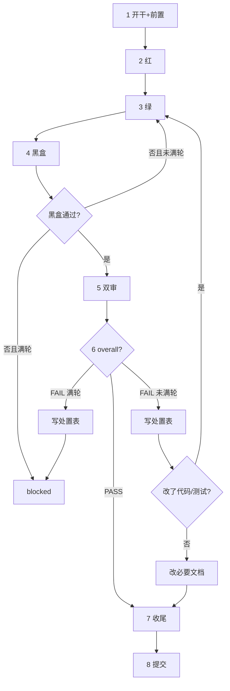

# tasks-run

串行执行待做 task，直到队列空或必须停。门禁数字、状态机、blocked、目录权责等权威规则见 `AGENTS.md`；本 skill 只定义执行操作顺序。

## 队列内 task 已获批准

用户触发本 skill 即表示队列内 task 已批准执行。**禁止**进入 plan mode（`EnterPlanMode` / `ExitPlanMode`），**禁止**在开跑前重述计划征求同意，**禁止**把 spec 里已写明的内容再问一遍。直接从 Step 1 开始做。

需要停下的情形只有「整批停止条件」列出的那些，以及 preflight FAIL。

## 输入

| 用户输入 | 队列 |
|----------|------|
| 无参数 | `backlog` ∪ `active`（tid 升序）；**不含** blocked / done / dropped |
| 一个或多个 `tNNN` | 只跑这些（须 backlog/active；含 blocked 则整批停止，请用户选择加轮/dropped） |
| 状态词 `backlog` 和/或 `active` | 只跑这些状态的全部 |
| 写了 `blocked` | `blocked` 不入队。先按「整批停止条件」呈 blocked 选项请用户决策；用户当次明确继续后，再跑其余可跑 tid |

`done` / `dropped` 永不入队。CLI 一次只能带一个 `--status`，默认队列 = 两次 list 合并去重。

## 队列循环

1. 按输入解析范围 → 用 `scripts/task.py list --status ...` / `show` 得有序列表。
2. **一次只跑一个** tid；该 task `done`（或用户允许的终点）后再下一个。禁止并行多 task（单 task 内可派 subagent）。
3. 当前 task `blocked` → **整批停止**，按 `AGENTS.md`「blocked」请用户选择；不自动跳下一个（除非用户显式要求跳过并 drop/延后）。
4. 「循环」= 本 skill 内串行推进，不是后台常驻。

## 单 task 流程

门禁数字以 `AGENTS.md`「命名与状态」为准。`{doctor_cmd}` / `{test_cmd}` / `{blackbox_cmd}` 见 `AGENTS.md` 硬约束。



**开始或继续每个 task 时，先重新读仓库判断入口**（`scripts/task.py show <tid>` + task 目录下 `spec.md` / `task.md` / `review_*.md` + 分支 + `git status` + `diff_anchor` + 测试与实施笔记）：

| 状态 / 证据 | 从哪继续 |
|-------------|---------|
| `backlog` | Step 1 |
| `active`，无红灯证据 | Step 2 |
| 红已有、实现未完 | Step 3 |
| 绿过、黑盒未过 | Step 4 |
| 黑盒过、无双审 | Step 5 |
| 有 FAIL、未满轮 | Step 6 处置后按表回流 |
| `blocked` | 停止整批，呈 blocked 选项 |
| `done` / `dropped` | 跳过 |

### Step 1：开干与前置

1. 有 `{doctor_cmd}` 则跑；无则实施笔记写「无」。失败：停本 task 及整批，先解决环境或走 spike，不盲目 start。
2. `scripts/task.py start <tid>`。默认建 worktree `../{repo}_{tid}` 并软链 `.env`，同时锁定 spec 契约区 hash。
   - 只有**用户明确指令**不隔离时才加 `--no-worktree`。
   - **`cd` 进该 worktree 再改代码**；后续所有 Step 都在 worktree 内进行。
3. `scripts/task.py preflight <tid>`：占位符、契约区、依赖、分支、worktree 隔离、工作区脏项、索引↔目录↔分支交叉校验。
   - **FAIL 必须先修**，不得绕过继续。
4. `task.md` front matter 实写 `diff_anchor`（当前 HEAD）。
5. spec 契约区行为 AC 非空再进 Step 2（preflight 已查）。
6. spec 上下文区要求 spike：先做实验（见 `AGENTS.md`「spike」）；文档查询不能替代兼容实验。

### Step 2：红

可测部分先写失败测试；`{test_cmd}` 确认失败。测试须触达生产逻辑。

### Step 3：绿

实现至测试通过；`{test_cmd}` 确认。量大可派 subagent。

**改既有测试的纪律**：实现变更让旧测试语义失效时，新增覆盖新语义的测试；旧测试原样保留或整体删除并写明理由。禁止就地把旧测试的预期改成当前实现的输出。

### Step 4：黑盒

跑 `{blackbox_cmd}`。通过→Step 5。未通过且 `< max_verify_round` → 回 Step 3 再黑盒。未通过且 `≥ max_verify_round` → `block --reason blackbox`，整批停止。

### Step 5：双审

- `git add -N` 纳入本 task 产出；剔除无关/临时/`.scratch/`（`git reset <path>`）。
- 渲染 prompt（spec 契约区与上下文区由脚本注入，reviewer 不再自行读 spec）：
  ```bash
  scripts/render_review_prompts.py \
    --task-dir docs/tasks/{tid}_{slug} \
    --out-dir .scratch/review_prompts
  ```
- 派 subagent 时**只传文件路径**，不把 prompt 正文内联进派发消息（内联会成倍放大会话体积）。
- 按 `review_level`（front matter）决定派几路：
  | review_level | 派发 |
  |---|---|
  | `full` | code + test 两路**并行** |
  | `single` | 一路通用 reviewer（`general_prompt.txt`），不再细分代码/测试轴 |
- 报告写入 task 目录：`full` 写 `review_code.md` / `review_test.md`；`single` 写 `review_general.md`。多轮追加，不覆盖历史。

### Step 6：处置

- 处置表唯一落点：`task.md` → `## Review 处置`（格式见 `docs/tasks/task_template/task.md`）。`status` 仅：`已修` / `遗留` / `撤回`；`category` 抄 reviewer 报告。
- `status=遗留` 的**内容**不写在 task.md：登记到 `docs/pending.md`「遗留待办」节拿 `fNNN`，`fix_ref` 填该 `fNNN`（已有 follow-up task 则填 tid）。task.md 只留引用，不留正文——task 目录会随 `finish` 归档，遗留留在里面等于丢。
- `max_review_round` 取 `AGENTS.md` 默认或用户加轮后的新上限（实施笔记有记录）：
  ```bash
  scripts/check_review_status.py \
    --task-dir docs/tasks/{tid}_{slug} \
    --max-review-round <N>
  ```
  读 `overall` / `round` / `withdraw_rate` / `prompt_hint`。`round` 是**回归轮次**（上轮 FAIL 修完重审才计数），不是 reviewer 出场次数。
- `prompt_hint` 非空 → 下一轮渲染后，在派发消息里附上轮撤回的 finding_id 与理由。
- `category=spec_drift` 的处置是**改 spec 上下文区**，不计 FAIL，不因此回 Step 3。
- `overall=PASS` → Step 7。
- `FAIL` 且 `round < max`：填处置表 → 改了代码/测试则 Step 3→4→5→6；未改则改必要文档后直接 Step 7（不改写 review verdict）。
- `FAIL` 且 `round ≥ max`：处置表填完 → `block --reason review`，整批停止。
- **禁止**同一 round 内「复核翻 PASS」；修代码必须完整下一轮双审。

### Step 7：收尾

- 更新 `docs/specs/<slug>.md` 与 `docs/specs_index.md`。
- 更新受影响的 `docs/blueprint/`、`docs/guides/`、`README.md`、`AGENTS.md`、API 文档等。
- 写全 `task.md` 收尾报告（引用 AC 与证据，不复制 AC 正文；各轮 verdict）。收尾报告**不设遗留节**——遗留在 `docs/pending.md`。
- **pending 闭环**（本 task 消化了 `docs/pending.md` 中条目，或 spec 引用 `bNNN` / `fNNN`）：
  1. bug 条目 `- 修复：未修` 改为 `- 修复：{tid}`；遗留条目 `- 处理：未开 task` 改为 `- 处理：{tid}`（已是本 tid 则不动）。
  2. **整条**从 `docs/pending.md` 移除，**追加**到 `docs/archive/pending.md` 的对应节（不截断 archive）。
  3. 无关联条目则跳过。
- **遗留登记**（与 Step 6 呼应，收尾再核一遍）：处置表所有 `status=遗留` 的行，其 `fix_ref` 必须指向 `fNNN` 或 follow-up tid。仍为空的立即补登 `docs/pending.md`「遗留待办」节，`- 来源` 写 finding_id。
- **findings 抽取**：本 task 做过 spike，或产出可跨 task 复用的已验证事实（工具行为、平台差异、依赖坑、性能特征、被证伪的假设），抽一条进 `docs/findings.md` 拿 `dNNN`；spike 报告全文移入 `docs/archive/spikes/`。只记已验证的事实，推测不进。
- 排在其后且未 `done` 的 task 若受影响，修订其 `spec.md`。
- `scripts/task.py finish <tid>`（目录归档 + worktree 移除 + 索引重建）。
  - `finish` 会移除 worktree，**先 `cd` 回主仓再执行**，否则脚本会拒绝移除并要求手动清理。

### Step 8：提交（执行期）

- 本 task 执行期的改动**至少一个 commit**，可按逻辑拆多个原子 commit；每个 subject 都含 `{tid}`。
- task = 一个可 review 的交付单元；commit = 实施原子。归档移动与文档更新随最后一个 commit。
- 在 task 分支上提交；合并回主干用 `--no-ff` 保留 task 边界。
- **blocked 未放行前**不当 done 提交、不 `finish`。

## 整批停止条件

遇任一即停，不自动跳当前 task 跑下一个（除非用户显式要求跳过）：

- `preflight` FAIL 且无法在本 task 内修复
- 当前 task `blocked`（呈加轮 / dropped）
- 需用户提供密钥、环境、产品决策等不可替代输入
- 环境/权限/外部依赖阻断；基础设施连续失败（503、网络、subagent 启动失败）→ `block --reason infra`
- 用户限制了本次终点（如「只跑到 review」）
- 工作区有与本队列冲突的无关脏改动且无法安全隔离

## 边界

- 执行期一个 task 一个交付单元；创建期与维护期 commit 不与执行期混。
- `blocked` 整批停，不自动跳下一个。
- 每步循环纪律：读仓库状态 → 执行当前步骤 → 用命令/文件验证 → 更新 `task.md` → 再判断。禁止只靠「会话里做到哪」续跑。
- 不进 plan mode（见开头）。

## 完成

汇报：已完成 tid、停止原因、blocked 选项（若有）、剩余队列。
