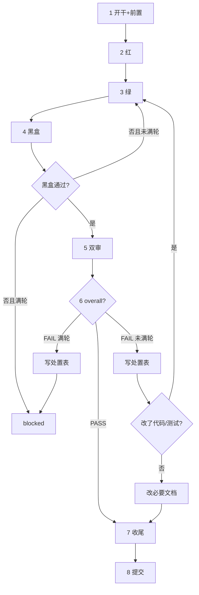

# tasks-run

串行执行待做 task，直到队列空或必须停。门禁数字、状态机、blocked、目录权责等权威规则见 `AGENTS.md`；本 skill 只定义执行操作顺序。

## 输入

| 用户输入 | 队列 |
|----------|------|
| 无参数 | `backlog` ∪ `active`（tid 升序）；**不含** blocked / done / dropped |
| 一个或多个 `tNNN` | 只跑这些（须 backlog/active；含 blocked 则整批停止，请用户选择加轮/dropped） |
| 状态词 `backlog` 和/或 `active` | 只跑这些状态的全部 |
| 写了 `blocked` | `blocked` 不入队。先按「整批停止条件」呈 blocked 选项请用户决策；用户当次明确继续后，再跑其余可跑 tid |

`done` / `dropped` 永不入队。CLI 不能一次 list 多 status，默认队列 = 两次 list 合并去重。

## 队列循环

1. 按输入解析范围 → 用 `scripts/task.py list --status ...` / `show` 得有序列表。
2. **一次只跑一个** tid；该 task `done`（或用户允许的终点）后再下一个。禁止并行多 task 抢同一工作区（单 task 内可派 subagent）。
3. 当前 task `blocked` → **整批停止**，按 `AGENTS.md`「blocked」请用户选择；不自动跳下一个（除非用户显式要求跳过并 drop/延后）。
4. 「循环」= 本 skill 内串行推进，不是后台常驻。

## 单 task 流程

门禁数字以 `AGENTS.md`「命名与状态」为准。`{doctor_cmd}` / `{test_cmd}` / `{blackbox_cmd}` 见 `AGENTS.md` 硬约束。



**开始或继续每个 task 时，先重新读仓库判断入口**（`scripts/task.py show <tid>` + task 目录下 `spec.md` / `plan.md` / `task.md` / `review_*.md` + 分支 + `git status` + `diff_anchor` + 测试与过程记录）：

| 状态 / 证据 | 从哪继续 |
|-------------|---------|
| `backlog` | Step 1 |
| `active`，无红灯证据 | Step 2 |
| 红已有、实现未完 | Step 3 |
| 绿过、黑盒未过 | Step 4 |
| 黑盒过、无双审 | Step 5 |
| 有 FAIL、未满轮 | Step 6 处置后按表回流 |
| `blocked` | 停止整批，呈 blocked 选项 |
| `done` / `dropped` | 跳过 |

### Step 1：开干与前置

- 有 `{doctor_cmd}` 则跑；无则过程记录写「无」。失败：停本 task 及整批，先解决环境或走 spike，不盲目 start。
- 建并切换分支 `{tid}_{slug}`；`scripts/task.py start <tid>`（自动登记 branch）；校验 `git branch --show-current`。
- `task.md` front matter：实写 `diff_anchor`（当前 HEAD）、`branch`。
- `spec.md` 行为 AC 非空再进 Step 2。
- plan/spec 要求 spike：先做实验（见 `AGENTS.md`「spike」）；文档查询不能替代兼容实验。

### Step 2：红

可测部分先写失败测试；`{test_cmd}` 确认失败。测试须触达生产逻辑。

### Step 3：绿

实现至测试通过；`{test_cmd}` 确认。量大可派 subagent。

### Step 4：黑盒

跑 `{blackbox_cmd}`。通过→Step 5。未通过且 `< max_verify_round` → 回 Step 3 再黑盒。未通过且 `≥ max_verify_round` → `block`（blackbox），整批停止。

### Step 5：双审

- `git add -N` 纳入本 task 产出；剔除无关/临时/`.scratch/`（`git reset <path>`）。
- 渲染 prompt：
  ```bash
  scripts/render_review_prompts.py \
    --task-dir docs/tasks/{tid}_{slug} \
    --out-dir .scratch/review_prompts
  ```
- 两 subagent **并行**：`code_review_prompt.md` → code reviewer；`test_review_prompt.md` → test reviewer。
- 报告写入 task 目录 `review_code.md` / `review_test.md`（追加轮次，不覆盖历史）。

### Step 6：处置

- 处置表唯一落点：`task.md` → `## Review 处置`（格式见 `docs/tasks/task_template/task.md`）。`status` 仅：`已修` / `遗留` / `撤回`。
- `max_review_round` 取 `AGENTS.md` 默认（4）或 `task.md` 过程记录中用户加轮后的新上限：
  ```bash
  scripts/check_review_status.py \
    --task-dir docs/tasks/{tid}_{slug} \
    --max-review-round <N>
  ```
  读 `overall` / `round` / `max_review_round`。
- `overall=PASS` → Step 7。
- `FAIL` 且 `round < max`：填处置表 → 改了代码/测试则 Step 3→4→5→6；未改则改必要文档后直接 Step 7（不改写 review verdict）。
- `FAIL` 且 `round ≥ max`：处置表填完 → `block`（review），整批停止。
- **禁止**同一 round 内「复核翻 PASS」；修代码必须完整下一轮双审。

### Step 7：收尾

- 更新 `docs/specs/<slug>.md` 与 `docs/specs_index.md`。
- 更新受影响的 `docs/blueprint/`、`docs/guides/`、`README.md`、`AGENTS.md`、API 文档等。
- 写全 `task.md` 收尾报告（引用 AC 与证据，不复制 AC 正文；各轮 verdict 与遗留；轮次按实际发生列出，上限见 `max_review_round`）。
- **bugs 闭环**（本 task 修复了 `docs/bugs.md` 中条目，或 plan/spec 引用 `bNNN`）：
  1. 对应条目将 `- 修复：未修` 改为 `- 修复：{tid}`（已是本 tid 则不动）。
  2. **整条**从 `docs/bugs.md` 移除，**追加**到 `docs/archive/bugs.md`（与 `repo-hygiene` 规则一致；不截断 archive）。
  3. 无关联 bug 条目则跳过。
- 排在其后且未 `done` 的 task 若受影响，修订其 `spec.md` / `plan.md`。
- `scripts/task.py finish <tid>`（JSON 归档 + 目录移入 `docs/archive/tasks/`）。

### Step 8：提交（执行期）

- **本 task 执行期全部改动一个 commit**（含实现、测试、specs、文档、归档移动）。
- subject 含 `{tid}`；在 task 工作分支上提交。
- **blocked 未放行前**不当 done 提交、不 `finish`。

## 整批停止条件

遇任一即停，不自动跳当前 task 跑下一个（除非用户显式要求跳过）：

- 当前 task `blocked`（呈加轮 / dropped）
- 需用户提供密钥、环境、产品决策等不可替代输入
- 环境/权限/外部依赖阻断
- 用户限制了本次终点（如「只跑到 review」）
- 工作区有与本队列冲突的无关脏改动且无法安全隔离

## 边界

- 执行期严格**one task one commit**（区别于创建期可一批）。
- `blocked` 整批停，不自动跳下一个。
- 每步循环纪律：读仓库状态 → 执行当前步骤 → 用命令/文件验证 → 更新 `task.md` → 再判断。禁止只靠「会话里做到哪」续跑。

## 完成

汇报：已完成 tid、停止原因、blocked 选项（若有）、剩余队列。
