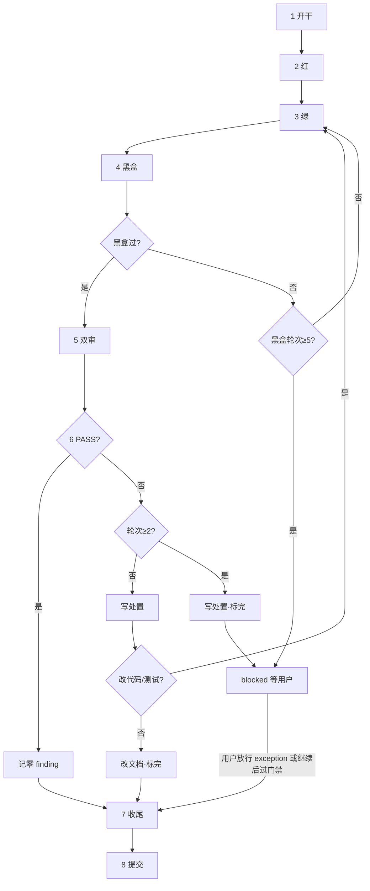

{一句话介绍：这个项目是什么、给谁用。}

本文件是 agent 行为入口，包含工作流规则与按需导航。只加载当前任务所需文档。

## 命名（本文件内只在此定义）

- `{tid}`：task 编号，形如 `t001`、`t042`（小写 `t` + 数字）。
- `{sid}`：spike 编号，形如 `s001`、`s003`（小写 `s` + 数字）。
- `{slug}`：小写 `snake_case`。
- 工作区目录：`docs/tasks/{tid}_{slug}/`
- 工作分支：`{tid}_{slug}`（如 `t001_foo`）
- finding：`{tid}_code_fNNN` / `{tid}_test_fNNN`
- spike 目录：`docs/spikes/{sid}_{slug}/`
- 下文「task 目录 / 工作分支」均指上式。

## 目录与读写规则

| 路径                                         | 用途                                      | 读取规则                                                                                                                          | 写入规则                                                                                     |
| -------------------------------------------- | ----------------------------------------- | --------------------------------------------------------------------------------------------------------------------------------- | -------------------------------------------------------------------------------------------- |
| `docs/specs_index.md`                      | 当前生效 spec 清单（在表即生效）          | 追溯已固化需求时                                                                                                                  | task**收尾**时更新；废弃时删除行                                                       |
| `docs/specs/<slug>.md`                     | 需求级 spec（按已完成 task 累积）         | 追溯需求实现与验收时                                                                                                              | task**收尾**时累积更新；废弃时移入 `docs/archive/specs/`                             |
| `docs/tasks_index.md`                      | tid、状态、branch                         | 接到新需求或状态流转时                                                                                                            | 新需求和状态流转时更新                                                                       |
| `docs/tasks/{tid}_{slug}/`                 | task 工作区（backlog 起即存在）           | 执行或审阅 task 时                                                                                                                | 实现侧：`spec.md` `plan.md` `task.md`；reviewer：`review_code.md` `review_test.md` |
| `docs/handoff.md`                          | 项目级交接                                | 接手工作时第一个读                                                                                                                | 只追加                                                                                       |
| `docs/blueprint/`                          | 当前长期真相：架构、领域、约定、决策      | 改跨模块行为前读`architecture.md`；写代码或文档前读 `conventions.md`；新业务概念读 `domain.md`；历史取舍读 `decisions.md` | finalization 时更新；实施与 review 期间仅写入已稳定结论                                      |
| `docs/reviews/review_<TS>/`                | 独立 review：多模型报告 + adoption 决策   | 审阅全代码 / diff / 指定范围时                                                                                                    | 用户命令后生成                                                                               |
| `docs/spikes/{sid}_{slug}/`                | 当前 spike                                | 技术选型或未知风险验证时                                                                                                          | `report.md` 必需；有实验代码再建 `code/`                                                 |
| `docs/templates/`                          | task / spike 等模板                       | 创建工作项时复制                                                                                                                  | 复制使用，不代表 active 数据                                                                 |
| `docs/guides/`                             | 给人看的使用指南                          | 按需                                                                                                                              | 给人读，不写入 agent 行为规则                                                                |
| `docs/archive/`                            | 完结或终止的历史                          | 追溯历史时                                                                                                                        | 镜像原路径，只进；内部文件只准新增                                                           |
| `schemas/`                                 | 跨服务接口契约                            | 实现或消费服务前                                                                                                                  | 改契约走 task 流程；类型落点见`docs/blueprint/conventions.md`                              |
| `config/`                                  | 配置（默认 + 环境覆盖 +`.env.example`） | 部署、调试、新增服务时                                                                                                            | 仅`.env.example` 入库；真值写本地 `.env`                                                 |
| `src/` `tests/` `scripts/` `assets/` | 源码、测试、脚本、静态源                  | 正常开发                                                                                                                          | 正常开发                                                                                     |
| `artifacts/` `data/` `.scratch/`       | 产物、运行数据、一次性草稿                | —                                                                                                                                | 运行与草稿；临时日志放`.scratch/`                                                          |

## 开发原则

- specs driven：先拆 task 并填写 spec/plan（验收标准非空）；后置 task 的 spec/plan 随前置完成修订。
- TDD：可测部分先红后绿。
- 长期真相延后：未稳定方案留在 task；中途要固化长期真相则拆独立 task，task 完结时更新 blueprint。

## 开发工作流

### 总览

- 一个**需求**拆成 N 个 **task**（每个结果独立可验证；过大则继续拆；一个 task 内一个 commit）。
- 每个 task 走一遍「单 task 流程」。
- `tasks_index` 状态：`backlog` / `active` / `blocked` / `done` / `dropped`。
- `blocked`：黑盒满 5 轮仍未过，或双审满 2 轮仍 `overall=FAIL`；**默认不收尾**，停自动推进，口头说明原因，等用户：加轮继续 / `dropped` / 显式 exception 后收尾。
- 实现侧过程写在 `task.md`。

### 新需求拆分与创建 task

1. 读 `docs/tasks_index.md`（含 backlog），取最大 `tid` 加一分配；可一次分配多个。
2. 对每个 task：
   - 登记 `backlog`；
   - 创建 task 目录；
   - 从 `docs/templates/task/` 复制并填写 `spec.md`、`plan.md`、`task.md`（front matter：`tid`/`slug`/`status: backlog`；`diff_anchor` 可占位，**开干**时写实值）。

### 单 task 流程

下图只示意分支；**以步骤正文为权威**。



步骤：

1. **开干**

   - 创建并切换工作分支；校验 `git branch --show-current` 与 `tasks_index.branch` 一致。
   - `tasks_index`：该行改为 `active`，填 `branch`。
   - `task.md` front matter：写入 `diff_anchor`（当前 HEAD SHA）、`branch`、`status: active`（`tid`/`slug` 在 backlog 已填）。
   - `spec.md` 验收标准非空后再进入 **红**。
2. **红**

   - 可测试部分先写失败测试；运行 `{test_cmd}` 确认失败。
3. **绿**

   - 实现至测试通过；运行 `{test_cmd}` 确认通过。任务量大可派 sub agent。
4. **黑盒**

   - 运行 `{blackbox_cmd}`。
   - **通过** → 进入 **双审**。
   - **未通过** 且黑盒轮次 **< 5** → 回 **绿** 修复后再跑本步（最多 5 轮，含首次）。
   - **未通过** 且黑盒轮次 **≥ 5** → **blocked**（见下「blocked」）：**不得**进 **双审**，**不得**自动 **收尾**。
5. **双审**

   - 前置：本 task **黑盒已通过**（blocked 经用户加轮并过黑盒后可再入）。
   - 渲染 reviewer 提示词（正文嵌在脚本内，从 `task.md` front matter 填占位符；产物不入库）：
     ```bash
     scripts/render_review_prompts.sh \
       --task-dir docs/tasks/{tid}_{slug} \
       --out-dir .scratch/review_prompts
     ```
   - 将 `.scratch/review_prompts/code_review_prompt.md` 与 `.scratch/review_prompts/test_review_prompt.md` 全文分别发给 code reviewer、test reviewer。
   - 报告写入本 task 目录 `review_code.md`、`review_test.md`。
6. **处置**（每轮双审结束后执行）

   - **处置表位置（唯一）**：本 task 目录 `task.md` 中的二级标题 **`## Review 处置`**。在其下按轮追加 `### Round N (YYYY-MM-DD HH:MM UTC+8)`，再写 Markdown 表（列：`finding_id | severity | status | rationale | fix_ref`）。格式见 `docs/templates/task/task.md` 同名小节。表就在这里写，不另建文件、不写到 `review_*.md`。
   - **`status` 仅三值**：`已修`（本 task 已改完）/ `遗留`（本 task 解决不了；满轮 blocked 或用户放行 exception 后收尾时写入报告并口头说）/ `撤回`（误报；须原 reviewer 在对应 `review_*.md` 末尾追加撤回记录后才能标撤回）。
   - 跑状态脚本：

     ```bash
     scripts/check_review_status.sh --task-dir docs/tasks/{tid}_{slug}
     ```

     读 `code_verdict` / `test_verdict` / `overall` / `round` / `next_action`。`max_round` 默认 **2**（满 2 轮后不再自动开新一轮双审）。
   - **`overall=PASS`**：在 `## Review 处置` 下写本轮「零 finding，未进处置表」（或前轮已处置完毕）→ 进入 **收尾**。
   - **`overall=FAIL` 且 `round < 2`**：在 `## Review 处置` 追加本轮表，逐条填 status（不得留空）。

     - **是（改了代码或测试）** → 回 **绿** → **黑盒** → **双审** → **处置**。
     - **否（未改代码或测试）** → 改必要文档后 **直接收尾**（不再开下一轮双审）。典型：仅文档、全标 `遗留`/`撤回`、或认为无需再实现。`review_*` verdict **不改写**；有 `遗留` 或 overall 仍为 FAIL 时按 exception 记 `done_with_exception` 并口头说明。
   - **`overall=FAIL` 且 `round ≥ 2`**：在 `## Review 处置` 追加本轮表，未修项 status 全部填完 → **blocked**（见下）：**不得**自动 **收尾**。
7. **收尾**

   - **前置（满足其一，且黑盒已通过；黑盒 blocked 仅用户 exception 可破）**：
     1. 双审 **`overall=PASS`**；或
     2. 双审 FAIL 且 `round < 2`，处置表已填完，且选择 **未改代码/测试**（见 **处置**）；或
     3. **blocked** 经用户显式 exception / 降级。
   - 禁止：黑盒满 5 未过、或双审满 2 仍 FAIL 时 agent 自行收尾。
   - 更新 `docs/specs/<slug>.md` 与 `docs/specs_index.md`（本 task 对应累积；黑盒未过的 exception 不得把未验证结论写成已生效验收）。
   - 更新本 task 影响到的 `docs/blueprint/`、`docs/guides/`、`README.md`、API 文档等。
   - 写全 `task.md`「收尾报告」（验收勾选、两轴 verdict、exception/遗留/blocked 放行依据）；front matter `status: done`。
   - `tasks_index` → `done`。exception 时备注 `done_with_exception` 及依据（`finding_id` / 用户放行），口头说明。
   - 后置 task 受影响则修订其 `spec.md` / `plan.md`。
   - 将 task 目录移入 `docs/archive/tasks/`。
8. **提交**

   - 本 task 全部改动（含 specs、文档、归档移动）做一个 commit。
   - subject 含 `{tid}`；只在本 task 工作分支上提交。合并进默认分支由外部流程负责。
   - **blocked 未放行前**：不把本 task 当 done 提交；可在分支上保留工作区，不归档。

### blocked

门禁打满仍未过时进入，**不是** `done`。

| 触发 | 动作 |
|------|------|
| 黑盒轮次 ≥ 5 仍未通过 | 过程记录写明原因与轮次；`task.md` / `tasks_index` → `blocked`；备注 `blocked: blackbox`；口头说明；停自动推进 |
| 双审 `overall=FAIL` 且 `round ≥ 2` | 处置表填完；`blocked`；备注 `blocked: review`；口头说明；停自动推进 |

用户出口（须显式）：

- **加轮**：备注批准加轮；`status` 回 `active`；黑盒加轮从 **绿** 再跑黑盒；双审加轮覆盖 `max_round` 后续跑 **双审**→**处置**。
- **dropped**：走 task dropped。
- **exception 收尾**：用户明确接受风险后才进 **收尾**；`done_with_exception` + 依据；**不改写** `review_*` 的 verdict。

### review target

- 审查证据固定为：`git diff <diff_anchor>`（相对工作区）。`diff_anchor` 取自 `task.md` front matter。
- 同步主线时更新 front matter 的 `diff_anchor`，并在 `task.md`「过程记录」记一笔。

### task dropped

- backlog：`tasks_index` → `dropped` + 原因；目录一律进 `docs/archive/tasks/`。
- active / blocked：`task.md`「过程记录」写终止原因；`status: dropped`；半成品只留在 task 分支并归档目录；若已写过 specs，撤销本 task 对 specs 的增量。

## handoff

- 仅项目级，追加 `docs/handoff.md`。
- 接手先读 `docs/handoff.md`。
- 记录须含 branch 与交出时已有的 head_commit。

## spike

- 选型或未知风险时用；非默认必做。
- 建 `docs/spikes/{sid}_{slug}/`，复制 `docs/templates/spike/report.md`；`sid` 取 spikes 与 archive 中最大编号加一。
- 有实验代码再建 `code/`；可入库，仅作验证材料。
- 结论后移入 `docs/archive/spikes/`。

## 硬约束

- {密钥规则、禁写路径、平台限制等项目特有约束，按需填写。}
- `{test_cmd}`：日常测试（单测/集成/单文件）；**红** / **绿** 使用。命令多时改为指向 `docs/guides/testing.md`。
- `{blackbox_cmd}`：黑盒验证；**黑盒** 使用。
- 测试规范见 `docs/blueprint/conventions.md`「编码与测试」。
